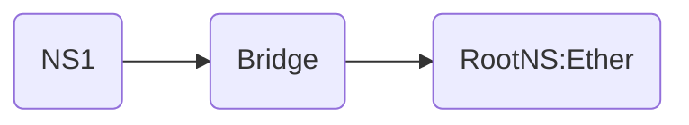
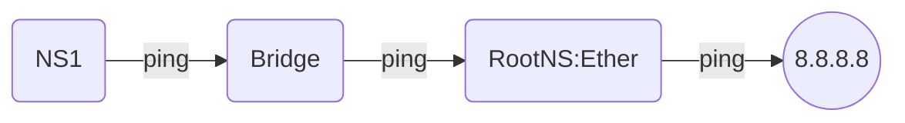

# Basic Networking and Cloud Networking

### [What is Networking?](https://github.com/HasanTareq73/GCP-Study-Guide/blob/main/Basic%20Networking%20and%20Cloud%20Networking/README.md#what-is-networking-1)
### [What is MAC Address?](https://github.com/HasanTareq73/GCP-Study-Guide/blob/main/Basic%20Networking%20and%20Cloud%20Networking/README.md#what-is-mac-address-1)
### [What is NIC Card?](https://github.com/HasanTareq73/GCP-Study-Guide/blob/main/Basic%20Networking%20and%20Cloud%20Networking/README.md#what-is-nic-card-1)
### [What is IP Address?](https://github.com/HasanTareq73/GCP-Study-Guide/blob/main/Basic%20Networking%20and%20Cloud%20Networking/README.md#what-is-ip-address-1)
### [What is subnetting and subnet?](https://github.com/HasanTareq73/GCP-Study-Guide/blob/main/Basic%20Networking%20and%20Cloud%20Networking/README.md#what-is-subnetting-and-subnet-)
### [What is a network switch?](https://github.com/HasanTareq73/GCP-Study-Guide/blob/main/Basic%20Networking%20and%20Cloud%20Networking/README.md#what-is-a-network-switch-)
### [What is Routing?](https://github.com/HasanTareq73/GCP-Study-Guide/blob/main/Basic%20Networking%20and%20Cloud%20Networking/README.md#what-is-routing-1)
### [OSI Model](https://github.com/HasanTareq73/GCP-Study-Guide/blob/main/Basic%20Networking%20and%20Cloud%20Networking/README.md#osi-model-1)
### [What is Socket and Socket binding?](https://github.com/HasanTareq73/GCP-Study-Guide/blob/main/Basic%20Networking%20and%20Cloud%20Networking/README.md#what-is-socket-and-socket-binding-1)
### [What is DNS?](https://github.com/HasanTareq73/GCP-Study-Guide/blob/main/Basic%20Networking%20and%20Cloud%20Networking/README.md#what-is-dns-1)
### [How does DNS work?](https://github.com/HasanTareq73/GCP-Study-Guide/blob/main/Basic%20Networking%20and%20Cloud%20Networking/README.md#how-does-dns-work-1)
### [What are the steps in a DNS lookup?](https://github.com/HasanTareq73/GCP-Study-Guide/blob/main/Basic%20Networking%20and%20Cloud%20Networking/README.md#what-are-the-steps-in-a-dns-lookup-1)
### [What is a DNS query?](https://github.com/HasanTareq73/GCP-Study-Guide/blob/main/Basic%20Networking%20and%20Cloud%20Networking/README.md#what-is-a-dns-query-1)
### [Egress and Ingress flow](https://github.com/HasanTareq73/GCP-Study-Guide/blob/main/Basic%20Networking%20and%20Cloud%20Networking/README.md#egress-and-ingress-flow-1)
### [What is Container?](https://github.com/HasanTareq73/GCP-Study-Guide/blob/main/Basic%20Networking%20and%20Cloud%20Networking/README.md#what-is-container-1)
### [What is Docker?](https://github.com/HasanTareq73/GCP-Study-Guide/blob/main/Basic%20Networking%20and%20Cloud%20Networking/README.md#what-is-docker-)
### [What is Network Namespace?](https://github.com/HasanTareq73/GCP-Study-Guide/blob/main/Basic%20Networking%20and%20Cloud%20Networking/README.md#what-is-network-namespace-1)


---


### What is Networking?

A computer network is a set of computers sharing resources located on or provided by network nodes. The computers use common communication protocols over digital interconnections to communicate with each other.

### What is MAC Address?

A media access control address is a unique identifier assigned to a network interface controller for use as a network address in communications within a network segment. This use is common in most IEEE 802 networking technologies, including Ethernet, Wi-Fi, and Bluetooth.

### What is NIC Card?

A network interface controller is a computer hardware component that connects a computer to a computer network. Early network interface controllers were commonly implemented on expansion cards that plugged into a computer bus.

### What is IP Address?

An IP address, or Internet Protocol address, is **a series of numbers that identifies any device on a network**. Computers use IP addresses to communicate with each other both over the internet as well as on other networks.

### What is subnetting and subnet ?

To subnet a network is to create logical divisions of the network. Subnetting, therefore, involves dividing the network into smaller portions called subnets. Subnetting applies to IP addresses because this is done by borrowing bits from the host portion of the IP address. In a sense, the IP address then has three components - the network part, the subnet part and, finally, the host part.

### **What is a network switch** ?

A network switch is a device that operates at the Data Link layer of the OSI model (Layer 2). It takes in packets being sent by devices that are connected to its physical ports and sends them out again, but only through the ports that lead to the devices the packets are intended to reach.

### ****How does a network switch work?****

Once a device is connected to a switch, the switch identifies its media access control (MAC) address, a code that’s baked into the device’s network-interface card (NIC). The NIC attaches to the Ethernet cable that attaches to the switch.

The switch uses the MAC address to identify which attached device is sending outgoing packets, and where to deliver incoming packets.

When one device sends a data packet to another device, the packet enters the switch and the switch reads the header to determine what to do with it. The switch matches the destination address or addresses and sends the packet out through the appropriate ports that lead to the destination devices.


### What is Routing?

Routing is the process of selecting a path for traffic in a network or between or across multiple networks. Broadly, routing is performed in many types of networks, including circuit-switched networks, such as the public switched telephone network, and computer networks, such as the Internet.

Type of Routing:

1.  Static Routing
2.  Dynamic Routing

Dynamic Routing are also 2 types;

1.  Internal Routing (Example: RIP, EIGRP, OSPF, iBGP, ISIS)
2.  External Routing (Example: eBGP)


### OSI Model:

The OSI Model is a logical and conceptual model that defines network communication used by systems open to interconnection and communication with other systems. The Open System Interconnection (OSI Model) also defines a logical network and effectively describes computer packet transfer by using various layers of protocols.

### **7 Layers of the OSI Model**

OSI model is a layered server architecture system in which each layer is defined according to a specific function to perform. All these seven layers work collaboratively to transmit the data from one layer to another.

-   **The Upper Layers**: It deals with application issues and mostly implemented only in software. The highest is closest to the end system user. In this layer, communication from one end-user to another begins by using the interaction between the application layer. It will process all the way to end-user.
-   **The Lower Layers**: These layers handle activities related to data transport. The physical layer and datalink layers also implemented in software and hardware.

Upper and Lower layers further divide network architecture into seven different layers as below

-   Application (Layer-7)
-   Presentation (Layer-6)
-   Session (Layer-5)
-   Transport (Layer-4)
-   Network (Layer-3)
-   Data-link (Layer-2)
-   Physical layers (Layer-1)


.png)

### What is Socket and Socket binding?

A socket is an endpoint that enables communication between two processes. This communication is irrespective of where the processes are running. **Furthermore, we highlight that sockets in the context of TCP/IP-based networks are called a Network Socket or Internet Socket. In this case, a socket executes between transport and application layers of the TCP/IP stack.**

There are three main types of sockets:

-   **Datagram: a socket that creates the interprocess communication with User Datagram Protocol (UDP).** In this way, datagram sockets enable simple IP communication without establishing any connection between processes.
-   **Stream: sockets that enable the communication between processes with Transmission Control Protocol (TCP).** Thus, stream sockets require the execution of a three-way handshake to connect processes and provide communication with particular message delivering guarantees.
-   **Raw: sockets that read network traffic from a network interface regardless of the transmission layer protocol.** A typical use of raw sockets is on the development of packet sniffers.

A socket is created but does not have any address assigned. **So, the bind operation is responsible for establishing specific addresses to sockets.**

### **What is DNS?**

The Domain Name System (DNS) is the phonebook of the Internet. Humans access information online through [domain names](https://www.cloudflare.com/learning/dns/glossary/what-is-a-domain-name/), like [nytimes.com](http://nytimes.com) or [espn.com](http://espn.com). Web browsers interact through [Internet Protocol (IP)](https://www.cloudflare.com/learning/network-layer/internet-protocol/) addresses. DNS translates domain names to [IP addresses](https://www.cloudflare.com/learning/dns/glossary/what-is-my-ip-address/) so browsers can load Internet resources.

### ****How does DNS work?****

The process of DNS resolution involves converting a hostname (such as [www.example.com](http://www.example.com)) into a computer-friendly IP address (such as 192.168.1.1). An IP address is given to each device on the Internet, and that address is necessary to find the appropriate Internet device - like a street address is used to find a particular home. When a user wants to load a webpage, a translation must occur between what a user types into their web browser ([example.com](http://example.com)) and the machine-friendly address necessary to locate the [example.com](http://example.com) webpage.

### ****What are the steps in a DNS lookup?****

For most situations, DNS is concerned with a domain name being translated into the appropriate IP address. To learn how this process works, it helps to follow the path of a DNS lookup as it travels from a web browser, through the DNS lookup process, and back again. Let's take a look at the steps.

****The 8 steps in a DNS lookup:****

1.  A user types ‘[example.com](http://example.com)’ into a web browser and the query travels into the Internet and is received by a DNS recursive resolver.
2.  The resolver then queries a DNS root nameserver (.).
3.  The root server then responds to the resolver with the address of a Top Level Domain (TLD) DNS server (such as .com or .net), which stores the information for its domains. When searching for [example.com](http://example.com), our request is pointed toward the .com TLD.
4.  The resolver then makes a request to the .com TLD.
5.  The TLD server then responds with the IP address of the domain’s nameserver, [example.com](http://example.com).
6.  Lastly, the recursive resolver sends a query to the domain’s nameserver.
7.  The IP address for [example.com](http://example.com) is then returned to the resolver from the nameserver.
8.  The DNS resolver then responds to the web browser with the IP address of the domain requested initially.

Once the 8 steps of the DNS lookup have returned the IP address for [example.com](http://example.com), the browser is able to make the request for the web page:

1.  The browser makes a [HTTP](https://www.cloudflare.com/learning/ddos/glossary/hypertext-transfer-protocol-http/) request to the IP address.
2.  The server at that IP returns the webpage to be rendered in the browser (step 10).


### **What is a DNS query?**

A DNS query (also known as a DNS request) is a demand for information sent from a user's computer (DNS client) to a DNS server. In most cases a DNS request is sent, to ask for the IP address associated with a domain name. An attempt to reach a domain, is actually a DNS client querying the DNS servers to get the IP address, related to that domain.

## **Types of queries**

In general, there are two ways of resolving a host or a domain name to an IP address, using the domain name system – a **Recursive** query and a **non-Recursive** query.

1.  The **Recursive** query is, when a DNS client directly gets the IP address of a domain, by asking the name server system to perform the complete translation.
2.  The **non-Recursive** query is, when a DNS client contacts the name servers, one by one, until it finds the server, containing the needed information.

## **How do they work?**

The process behind **Recursive** queries, can be explained by the following example:

1.  A user opens up his favorite browser and enters [https://www.somedomain.com](https://www.somedomain.com) in the address bar. His computer does not know the IP address for [www.somedomain.com](http://www.somedomain.com), so it sends a request to the user’s DNS resolver.
2.  The resolver does not know the IP address for [www.somedomain.com](http://www.somedomain.com), so it will query one of the root DNS servers.
3.  The root servers know the locations of all the TLDs, such as .com, they do not know the IP of [www.somedomain.com](http://www.somedomain.com), so they return the location of the .com servers.
4.  Once the query reaches the .com TLD servers, it will find the Authoritative DNS server of [www.somedomain.com](http://www.somedomain.com) and will reply to the resolver with that server.
5.  The resolver will send a query to the Authoritative DNS server of the domain and will resolve it.
6.  The Authoritative DNS server of the domain will check within its database and will find an entry for [www.somedomain.com](http://www.somedomain.com), which has an IP address.
7.  Finally the resolver will know the IP address for [www.somedomain.com](http://www.somedomain.com) and will send the result to the user's computer.

The process behind **non-Recursive** queries, follows the same procedure, but the DNS client (the machine from which the user tries to resolve the domain) will have to find the authoritative DNS server for the domain, by itself.

### ****Egress and Ingress flow****

Egress in the world of networking implies traffic that exits an entity or a network boundary, while Ingress is traffic that enters the boundary of a network.

if we try to told simply, When we want to browse a website like Google or Facebook that means our request goes to the google server from our computer that’s Egress traffic or outbound traffic . when we try to download some document from google or Facebook and download is running that means traffic (download file) is coming in our computer that’s Ingress traffic or incoming traffic .


### What is Container?

**Containers are lightweight packages of your application code together with dependencies such as specific versions of programming language runtimes and libraries required to run your software services.**

### ****Containers vs. VMs****

You might already be familiar with VMs: a guest operating system such as Linux or Windows runs on top of a host operating system with access to the underlying hardware. Containers are often compared to virtual machines (VMs). Like virtual machines, containers allow you to package your application together with libraries and other dependencies, providing isolated environments for running your software services.

-   Containers are much more lightweight than VMs
-   Containers virtualize at the OS level while VMs virtualize at the hardware level
-   Containers share the OS kernel and use a fraction of the memory VMs require

### What is Docker ?

Docker is a set of platform as a service products that use OS-level virtualization to deliver software in packages called containers. The service has both free and premium tiers. The software that hosts the containers is called Docker Engine.

### What is Network Namespace?

Linux network namespaces are a Linux kernel feature allowing us to isolate network environments through virtualization. For example, using network namespaces, you can create separate network interfaces and routing tables that are isolated from the rest of the system and operate independently.

### **Create Your Namespaces**

Let’s create two network namespaces:

```bash
sudo ip netns add ns1

sudo ip netns add ns2

```

Once they are added we can view them with `ip netns list`.

now have a very simple container that can’t do much at the moment. To get more functionality we can connect the namespaces using a `veth` device.

### Create a Bridge

A Bridge is a **Layer 2 Switch** which defines a network and can hold multipule namespaces within this network using **veth** (virtual ethernet) cable. For example we are going to define 10.0.0.0/24 network to this bridge. Let's create a bridge first.

```bash
sudo ip link add vBridge type bridge

```

Now verify the bridge is created or not:

```bash
sudo ip link

```

As you can see the br0 bridge interface has been created but it's **DOWN**. Now turn it **UP** and assin an **IP address** to vBridge.

```bash
sudo ip link set vBridge up
sudo ip addr add 10.0.0.1/16 dev vBridge

```

### **Create a Virtual Ethernet Cable for Each Namespace**

A veth device is a virtual ethernet device that you can think of as a real ethernet cable connecting two other devices. Virtual ethernet devices act as tunnels between network namespaces. They create a bridge to a physical network device in another namespace.

In our example, we are creating two veth pairs. The ns1 namespace will connect to the veth-ns1 end of the cable, and the other cable end should attach to a bridge that will create the network for our namespaces. We create the same cable and connect it to the bridge on the ns2 side

To create both veth pairs, use the command:

```bash
sudo ip link add veth-ns1 type veth peer name bridge-ns1-veth
sudo ip link add veth-ns2 type veth peer name bridge-ns2-veth
```

Now when you look at the devices you will see your veth pairs on the host network.

```bash
ip link list
```

Now that we have a veth pair in the host namespace, let’s move the ns1 and ns2 sides of the cables out into the ns1 and ns2 namespaces.

```bash
sudo ip link set veth-ns1 netns ns1
sudo ip link set veth-ns2 netns ns2
```

Now if you check `ip link`, you will see the bridge-ns1-veth and bridge-ns2-veth is **missing**, because it **belongs** to **ns1 and ns2** now.

After that, Connect the other side of the cable **veth0** into the **Bridge**

```bash
sudo ip link set bridge-ns1-veth master vBridge
sudo ip link set bridge-ns1-veth master vBridge
```

## **Stablish NS1 to Bridge Communication**

Our objective is here to stablish communication between Namespace **ns1** to Bridge vBridge

Enter into **ns1** namespace and check the interfaces.

```bash
sudo nsenter --net=/var/run/netns/netns1
ip link
```

We need to turn **UP** both the lo (_loopback interface_) and bridge-ns1-veth and assign an **IP address** to bridge-ns1-veth

```bash
ip link set lo up
ip link set  bridge-ns1-veth up
ip addr add 10.0.0.10/24 dev  bridge-ns1-veth
exit
```

logging out from Namespace **netns1**

We are in **RootNS** now, turn **UP** the veth-ns1 interface

```bash
sudo ip link set veth-ns1 up
```

Now, log into the **ns1** and **ping** to vBridge (10.0.0.1)

```bash
ping 10.0.0.1
```

Output

```
PING 10.0.0.1 (10.0.0.1) 56(84) bytes of data.
64 bytes from 10.0.0.1: icmp_seq=1 ttl=64 time=0.065 ms
64 bytes from 10.0.0.1: icmp_seq=2 ttl=64 time=0.047 ms
64 bytes from 10.0.0.1: icmp_seq=3 ttl=64 time=0.047 ms
```

Communication between Namespace to Bridge is Successful.

****NS1 to RootNS Communication:****

Now we have try to communicate NS1 to RootNS via bridge.



log into the Namespace **netns1** and **ping** to 10.31.16.101 (RootNS IP address)

```bash
$ sudo nsenter --net=/var/run/netns/ns1
$ ping 10.31.16.101

output: 

ping: connect: Network is unreachable

$ route
output: 
Kernel IP routing table
Destination     Gateway         Genmask         Flags Metric Ref    Use Iface
10.0.0.0     0.0.0.0         255.255.255.0        U     0     0      0 veth-ns1
```

So we need add a default gateway in route table so that **any not matching** IP address will be forwarded via vBridge ****interface having IP **10.0.0.1**

Ok let's add the default gateway into the Routing Table of NS1

```bash
ip route add default via 10.0.0.1
route -n
```

Let's ping to RootNS again

```bash
ping 10.31.16.101
```

Output:

```bash
PING 10.31.16.101 (10.31.16.101) 56(84) bytes of data.
64 bytes from 10.31.16.101: icmp_seq=1 ttl=64 time=0.049 ms
64 bytes from 10.31.16.101: icmp_seq=2 ttl=64 time=0.045 ms
64 bytes from 10.31.16.101: icmp_seq=3 ttl=64 time=0.066 ms
```

Communication successful between NS1 to RootNS , Now we try communication 8.8.8.8 or others destination from NS1



Let's ping **8.8.8.8** from **ns1**

```bash
ping 8.8.8.8
```

Output:

```bash
PING 8.8.8.8 (8.8.8.8) 56(84) bytes of data.
```

Now this scenario is little bit tricky, it's not like the Network is unreachable but some how the packet is blocked or stuck in between somewhere. Lucky that Linux has a utility bin named **tcpdump** to observe the network interfaces to **debug** the **packet flow**.

### **Packet Debugging**

Now open a new SSH session and observe our gateway vBridge in **RootNS** first.

```bash
sudo tcpdump -i vBridge icmp
```

Output:

```bash
listening on br0, link-type EN10MB (Ethernet), capture size 262144 bytes
07:29:55.680062 IP ip-192-168-0-2.ap-south-1.compute.internal > dns.google: ICMP echo request, id 63613, seq 2156, length 64
07:29:56.704054 IP ip-192-168-0-2.ap-south-1.compute.internal > dns.google: ICMP echo request, id 63613, seq 2157, length 64
07:29:57.728056 IP ip-192-168-0-2.ap-south-1.compute.internal > dns.google: ICMP echo request, id 63613, seq 2158, length 64
```

Looks like vBridge is receiving icmp packets, but how about eth0. Let's check **eth0** interface now.

```bash
sudo tcpdump -i eth0 icmp
```

Output:

```bash
tcpdump: verbose output suppressed, use -v or -vv for full protocol decode
listening on eth0, link-type EN10MB (Ethernet), capture size 262144 bytes
```

Ops! No packets, There is something wrong. Let's check IPv4 forwarding **/proc/sys/net/ipv4/ip_forward**

```bash
cat /proc/sys/net/ipv4/ip_forward
```

output: 0

**Root Cause**: IP Forwarding is diabled. Lets **Enable IP Forwarding**

```bash
sudo nano /proc/sys/net/ipv4/ip_forward
```

change it from 0 to 1 and save it, then check it again

```bash
cat /proc/sys/net/ipv4/ip_forward
```

output: 1

Now observe eth0 again

```bash
sudo tcpdump -i eth0 icmp
```

Output:

```bash
tcpdump: verbose output suppressed, use -v or -vv for full protocol decode
listening on eth0, link-type EN10MB (Ethernet), capture size 262144 bytes
07:39:04.544093 IP ip-10-0-0-10.ap-south-1.compute.internal > dns.google: ICMP echo request, id 63613, seq 2692, length 64
07:39:05.568071 IP ip-10-0-0-10.ap-south-1.compute.internal > dns.google: ICMP echo request, id 63613, seq 2693, length 64
07:39:06.592091 IP ip-10-0-0-10.ap-south-1.compute.internal > dns.google: ICMP echo request, id 63613, seq 2694, length 64
```

But still the ping is stuck in **ns1** why is that? Notice! that the source ip is 10.0.0.10 which is trying to reach out to the google dns 8.8.8.8. with source ip 10.0.0.10 which is a **private ip**

### **Why I can not access internet through Private IP ?**

Think of your **IP address** like your **full postal address**. Letters sent to you from anywhere get delivered by the post service reading the address and getting it to the right place.

A **Private IP** address is like having **my bedroom** as the **whole address**. It's Useful inside the house, but of **no use** whatsoever for a letter **trying to reach** you **from another country**. The poor postman does not know where to start, so the letter gets put in the bin. and you get no data.

Simply put, where would the return packets go? You may be able to send a packet out (_though it’d probably be dropped by a firewall rather early_), but how would anyone get a packet **back to you**? Packets are solely addressed by IP address, and private IPs are, by design, **not unique**. If you do manage to get a packet to a server with a return address of **192.168.0.2**, where would it send its answer?

### **Solution**

To resolve this problem we somehow need to convert the private ip to public ip. This is called **[NAT](https://whatismyipaddress.com/nat)** (_Network Address Translation_)

We need to add a **SNAT** (_Source NAT_) rule in **IP Table** into the **POSTROUTING** chain

```bash
sudo iptables -t nat -A POSTROUTING -s 10.0.0.0/24 ! -o vBridge -j MASQUERADE
```

We have Done **Souce IP NAT** here, it means we are appending (-A) an IP MASQUERADE Rule into the NAT table (-t) where packets coming from source network (-s) 10.0.0.0/24 via output (-o) interface vBridge

More about [iptables](https://medium.com/skilluped/what-is-iptables-and-how-to-use-it-781818422e52)

Now Log into the Namespace **netns1** and try to ping 8.8.8.8 again

```bash
sudo nsenter --net=/var/run/netns/ns1
ping 8.8.8.8
```

Output:

```
PING 8.8.8.8 (8.8.8.8) 56(84) bytes of data.
64 bytes from 8.8.8.8: icmp_seq=1 ttl=109 time=1.67 ms
64 bytes from 8.8.8.8: icmp_seq=2 ttl=109 time=1.68 ms
64 bytes from 8.8.8.8: icmp_seq=3 ttl=109 time=1.71 ms
```
 We have done it. Now we are able to ping outside
